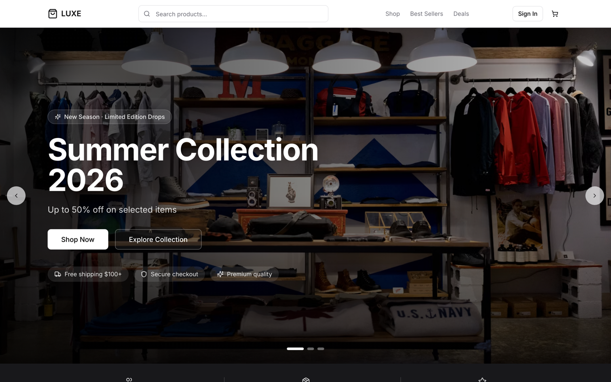
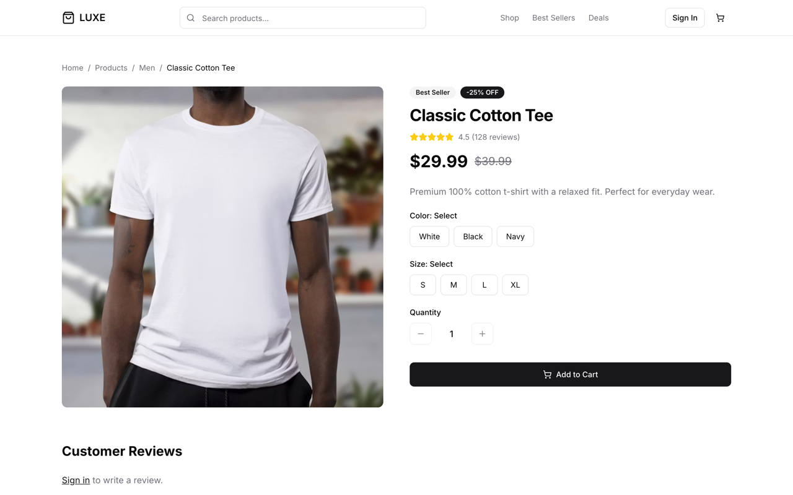
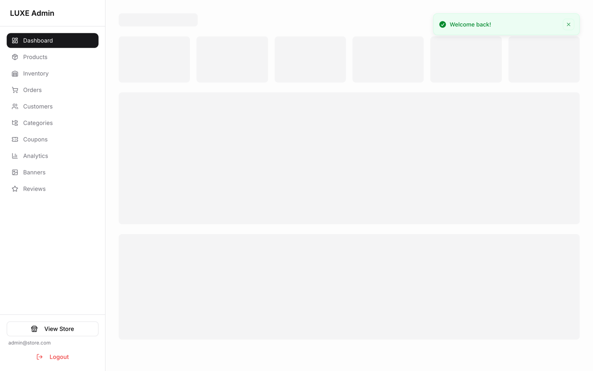

<div align="center">

# Ecommerce Storefront & Admin

**Production-grade ecommerce platform — customer storefront, admin ops, Stripe payments, and analytics in one cohesive system.**

[](https://ecomm-may2026.onrender.com/)
[](https://react.dev/)
[](https://www.typescriptlang.org/)
[](https://vitejs.dev/)
[](https://nodejs.org/)
[](https://www.prisma.io/)
[](https://stripe.com/)
[](./LICENSE)

**[→ Open Live Demo](https://ecomm-may2026.onrender.com/)** · [Admin Panel](https://ecomm-may2026.onrender.com/admin) · [Credentials & Test Data](./CREDENTIALS.md)

</div>

---

## Overview

**Ecommerce Storefront & Admin** is a full-stack commerce application built to mirror how real products ship — not a todo-app tutorial with a cart bolted on. It combines a polished customer storefront with a complete back-office: catalog management, inventory, coupons, order fulfillment, review moderation, and revenue analytics.

Built for **brands, agencies, and teams** who need a credible ecommerce foundation — or a portfolio piece that proves end-to-end product engineering. Every major flow is wired: registration, OAuth, cart persistence, Stripe Checkout, order lifecycle, and admin reporting.

This project is intentionally scoped to demonstrate **production-ready full-stack skills** relevant to senior frontend, full-stack, and platform engineering roles — modern React patterns, typed APIs, payment integration, auth hardening, and deployment awareness.

---

## Key Highlights

> **Scan this section in 30 seconds if you're hiring.**

- **End-to-end ownership** — React SPA, Express REST API, MongoDB/Prisma schema, JWT + OAuth auth, Stripe Checkout, Cloudinary uploads, seed data, and live deployment
- **Modern React architecture** — TanStack Query for server state, Zustand for client state, React Hook Form + Zod validation, React Router 7 with protected/admin routes
- **Production-like UX** — persistent cart, coupon codes, order history, stock-aware checkout, hosted Stripe payments, admin revenue dashboards
- **Real admin operations** — inline order/payment status, inventory per SKU, review moderation, category tree, banner CMS, analytics by period
- **Engineering rigor** — TypeScript throughout, Axios refresh-token queue, API proxy for dev, role-based access, demo mode fallback when Stripe is unconfigured
- **Ready to evaluate** — live demo, seeded accounts, test cards, and documented credentials — no setup required to click through

---

## Screenshots & Demo

<p align="center">
  
  <br /><em>Storefront — hero, categories, featured products</em>
</p>

<p align="center">
  
  <br /><em>Product detail — variants, pricing, add to cart</em>
</p>

<p align="center">
  
  <br /><em>Admin dashboard — revenue, orders, 30-day sales chart</em>
</p>

<div align="center">

### **[Open Live Demo →](https://ecomm-may2026.onrender.com/)**

Try checkout with test credentials below, then explore `/admin` with the admin account.

</div>

---

## Features

### Storefront
- Product catalog with filtering, sorting, and category navigation
- Product detail pages — size/color variants, stock awareness, reviews
- Persistent cart (Zustand + `localStorage`) with pre-checkout stock validation
- Stripe Checkout with success-page payment confirmation
- Coupon codes at checkout (`WELCOME10`, `SAVE20`)
- User registration, login, profile, and order history
- OAuth sign-in — Google, GitHub, Microsoft (when configured on backend)
- Responsive homepage — hero banners, flash sales, testimonials, newsletter

### Admin Dashboard
- **Dashboard** — revenue, orders, customers, pending alerts, 30-day sales chart
- **Products** — CRUD, multi-image upload (Cloudinary), pricing, flags (featured, best seller)
- **Inventory** — stock levels per size/SKU
- **Orders** — fulfillment + payment status controls
- **Customers** — registered account overview
- **Categories** — nested category tree
- **Coupons** — percentage/fixed discounts with usage limits
- **Analytics** — sales by day, top products, order status breakdown, revenue by category
- **Banners** — homepage hero CMS
- **Reviews** — approve, reject, or delete user reviews

### Platform
- JWT access + refresh tokens with silent session restore
- OAuth 2.0 with PKCE-style state handling (Google, GitHub, Microsoft)
- Stripe Checkout Sessions + client-side confirmation fallback
- Demo payment mode when Stripe keys are absent (local dev friendly)
- Rate limiting, Helmet, CORS, input sanitization on API
- Prisma ORM on MongoDB with typed domain models
- Database seed scripts with realistic orders and analytics data

---

## Tech Stack

| Layer | Technologies |
|-------|-------------|
| **Frontend** | React 18, TypeScript, Vite 6, Tailwind CSS, Radix UI / shadcn-style components, Lucide icons, Recharts, Sonner |
| **Backend & Database** | Node.js, Express 5, TypeScript, Prisma 6, MongoDB Atlas |
| **State & Data** | TanStack Query v5, Zustand, Axios, React Hook Form, Zod |
| **Auth & Security** | JWT (access + refresh), HTTP-only refresh cookies, OAuth 2.0, role-based routes, bcrypt, rate limiting |
| **Payments & Integrations** | Stripe Checkout, Cloudinary (image uploads), optional Stripe webhooks |

---

## Architecture

```
┌──────────────────────────────────────────────────────────────┐
│  React SPA  (Vite · localhost:5173 · Render prod)            │
│  ┌─────────────┐  ┌─────────────┐  ┌──────────────────────┐  │
│  │ StoreLayout │  │ AdminLayout │  │ AuthInitializer      │  │
│  │  (public)   │  │ (adminOnly) │  │ (silent refresh)     │  │
│  └──────┬──────┘  └──────┬──────┘  └──────────┬───────────┘  │
│         └────────────────┼─────────────────────┘             │
│  ┌─────────────────────▼──────────────────────────────────┐  │
│  │ TanStack Query (server state) │ Zustand (auth + cart)   │  │
│  └─────────────────────┬──────────────────────────────────┘  │
│                        │ Axios  →  /api  (Vite proxy in dev) │
└────────────────────────┼─────────────────────────────────────┘
                         ▼
┌──────────────────────────────────────────────────────────────┐
│  Express REST API  (localhost:5001 · Render prod)            │
│  ┌──────────┐ ┌─────────┐ ┌───────────┐ ┌────────────────┐  │
│  │ JWT/OAuth│ │ Stripe  │ │ Cloudinary│ │ Prisma → Mongo │  │
│  └──────────┘ └─────────┘ └───────────┘ └────────────────┘  │
└──────────────────────────────────────────────────────────────┘
```

**Design decisions worth noting:**

- **No direct DB access from the client** — all data flows through typed REST endpoints under `/api`
- **Vite dev proxy** — `/api` → backend avoids CORS friction and mirrors production path structure
- **Refresh token queue** — concurrent 401s share a single refresh attempt, preventing token stampedes
- **Storefront vs admin separation** — distinct layouts and route guards; admins auto-redirect to `/admin` post-login
- **Stripe dual-mode** — real Checkout when keys exist; simulated payment for zero-config local eval
- **Revenue semantics** — dashboard/analytics count only `paymentStatus: paid` orders for accurate reporting

---

## Project Structure

```
client/
├── src/
│   ├── App.tsx                 # Route tree — store + admin
│   ├── main.tsx                # Providers, error boundary
│   ├── types/                  # Shared domain interfaces
│   ├── lib/
│   │   ├── api.ts              # Axios + JWT refresh interceptor
│   │   ├── authFlow.ts         # Post-login redirect logic
│   │   ├── stripe.ts           # Stripe.js loader
│   │   └── utils.ts            # formatPrice, cn, helpers
│   ├── stores/
│   │   ├── authStore.ts        # User, tokens, isAdmin()
│   │   └── cartStore.ts        # Cart persistence + validation
│   ├── hooks/                  # Custom React hooks
│   ├── components/
│   │   ├── ui/                 # Design system primitives
│   │   ├── layout/             # Navbar, Footer, AdminLayout
│   │   ├── auth/               # ProtectedRoute, OAuthButtons
│   │   ├── admin/              # StatCard, ImageUpload
│   │   ├── home/               # Homepage sections
│   │   └── products/           # ProductCard, skeletons
│   └── pages/
│       ├── store/              # Customer-facing pages
│       └── admin/              # Admin dashboard pages
├── docs/                       # README screenshots (storefront, product, admin)
├── CREDENTIALS.md              # Logins, test cards, env checklist
├── .env.example
└── vite.config.ts              # @ alias + /api proxy
```

Path alias `@/` → `src/`. Backend lives in `../server` as a sibling package.

---

## Getting Started

**Estimated setup time: ~5–10 minutes** (with MongoDB Atlas URI ready)

### Prerequisites

- Node.js 18+
- MongoDB Atlas cluster (or local MongoDB)
- Optional: Stripe test keys, Cloudinary account

### 1. Clone & install

```bash
git clone <your-repo-url>
cd Ecommerce
```

### 2. Backend setup

```bash
cd server
npm install
cp .env.example .env   # or create .env — see Environment Variables
npm run seed           # users, products, orders, reviews
npm run dev            # http://localhost:5001
```

### 3. Frontend setup

```bash
cd ../client
npm install
cp .env.example .env
npm run dev            # http://localhost:5173
```

### 4. Open the app

| URL | Purpose |
|-----|---------|
| http://localhost:5173 | Storefront |
| http://localhost:5173/admin | Admin panel |
| http://localhost:5001/api/health | API health check |

### Environment Variables

**Client (`client/.env`)**

```env
VITE_API_URL=http://localhost:5001/api
VITE_STRIPE_PUBLISHABLE_KEY=pk_test_your_key
```

**Server (`server/.env`)** — key variables

| Variable | Purpose |
|----------|---------|
| `PORT` | API port (default `5001`) |
| `MONGODB_URI` | MongoDB connection string |
| `JWT_SECRET` | 32+ character signing secret |
| `CLIENT_URL` | Frontend origin for CORS/OAuth |
| `API_URL` | Backend URL for OAuth callbacks |
| `STRIPE_SECRET_KEY` | Stripe secret (`sk_test_…`) |
| `STRIPE_PUBLISHABLE_KEY` | Must match client key |
| `CLOUDINARY_*` | Image upload credentials |
| `GOOGLE_CLIENT_ID/SECRET` | Optional OAuth |

Full checklist → **[CREDENTIALS.md](./CREDENTIALS.md)**

---

## Usage Guide

### As a customer
1. Browse products at `/products` or from the homepage
2. Select size/color → **Add to Cart**
3. Register or log in (`john@example.com` / `customer123`)
4. Go to **Checkout** → enter shipping address
5. Apply coupon `WELCOME10` (orders ≥ $50) or `SAVE20` (orders ≥ $100)
6. Pay via Stripe Checkout (`4242 4242 4242 4242`) or demo-mode simulate button
7. View order in **Profile → Order History**

### As an admin
1. Log in at `/login` with `admin@store.com` / `admin123`
2. Auto-redirected to `/admin` dashboard
3. Monitor revenue, recent orders, and pending reviews
4. Manage catalog under **Products**, **Categories**, **Inventory**
5. Fulfill orders — update order status and payment status inline
6. Analyze performance under **Analytics** (7 / 30 / 90 day views)
7. Moderate reviews, edit banners, create coupons

---

## State, Authentication & Payments

### TanStack Query
- `useQuery` for all server reads (products, orders, dashboard stats, analytics)
- `useMutation` + targeted `invalidateQueries` on writes (e.g. order status → refresh dashboard + analytics)
- Default `staleTime: 60s` — balances freshness vs. request volume

### Zustand
| Store | Responsibility |
|-------|---------------|
| `authStore` | User, access/refresh tokens, `isAdmin()`, `logout()`, persisted to `localStorage` |
| `cartStore` | Line items, subtotal, persistence, stock sync before checkout |

### Authentication flow
1. Login → `POST /api/auth/login` → store tokens
2. `AuthInitializer` silently refreshes on app boot
3. 401 interceptor → refresh queue → retry original request
4. OAuth → provider redirect → `/auth/callback` → one-time code exchange
5. `ProtectedRoute` guards private pages; `adminOnly` checks `role === 'admin'`

### Payment flow

**Stripe Checkout (keys configured)**
```
Checkout → POST /orders → Stripe Session → redirect → pay
→ /checkout/success?session_id=… → POST /orders/confirm-checkout → paid
```

**Demo mode (no Stripe keys)**
```
Checkout → POST /orders → { demoMode: true } → "Simulate Payment Success"
→ POST /orders/:id/demo-payment → paid
```

---

## Routes

<details>
<summary><strong>Store routes</strong></summary>

| Path | Page | Auth |
|------|------|------|
| `/` | Home | Public |
| `/products` | Product listing | Public |
| `/products/:id` | Product detail | Public |
| `/cart` | Shopping cart | Public |
| `/checkout` | Checkout | Required |
| `/checkout/success` | Payment confirmation | Required |
| `/login` | Login | Public |
| `/register` | Register | Public |
| `/profile` | Account & orders | Required |
| `/orders/:id` | Order detail | Required |
| `/auth/callback` | OAuth exchange | Public |

</details>

<details>
<summary><strong>Admin routes</strong> (require admin role)</summary>

| Path | Page |
|------|------|
| `/admin` | Dashboard |
| `/admin/products` | Products |
| `/admin/inventory` | Inventory |
| `/admin/orders` | Orders |
| `/admin/customers` | Customers |
| `/admin/categories` | Categories |
| `/admin/coupons` | Coupons |
| `/admin/analytics` | Analytics |
| `/admin/banners` | Banners |
| `/admin/reviews` | Reviews |

</details>

---

## Production & Deployment

### Build

```bash
# Frontend
cd client && npm run build    # → dist/

# Backend
cd server && npm run build    # → dist/
cd server && npm start
```

### Live demo (Render)

The production demo at **[ecomm-may2026.onrender.com](https://ecomm-may2026.onrender.com/)** is deployed on **Render**:

- **Frontend** — static site or web service serving the Vite build
- **Backend** — Node web service with environment-injected secrets
- **Database** — MongoDB Atlas

**Deployment considerations handled:**
- `CLIENT_URL` set to production frontend origin (CORS)
- `API_URL` set for OAuth callback URIs
- Stripe test-mode keys for safe demo payments
- Health endpoint at `/api/health` for uptime checks
- Cold-start awareness on Render free tier (first load may take ~30s)

Production env example:

```env
VITE_API_URL=https://your-api.onrender.com/api
VITE_STRIPE_PUBLISHABLE_KEY=pk_live_...
```

---

## Credentials & Test Data

Everything needed to evaluate the app is pre-seeded. Full reference → **[CREDENTIALS.md](./CREDENTIALS.md)**

| Role | Email | Password |
|------|-------|----------|
| **Admin** | `admin@store.com` | `admin123` |
| **Customer** | `john@example.com` | `customer123` |

| Stripe test card | `4242 4242 4242 4242` |
|------------------|------------------------|
| Expiry / CVC | Any future date / any 3 digits |

| Coupon | Details |
|--------|---------|
| `WELCOME10` | 10% off (max $25), min order $50 |
| `SAVE20` | $20 off, min order $100 |

**Seed commands** (from `server/`):

```bash
npm run seed        # full reset + demo dataset
npm run seed:demo   # add orders without wiping existing data
```

---

## Use Cases & Extensibility

This codebase is designed as a **credible foundation**, not a dead-end demo:

- **Multi-tenant SaaS** — extend User/Store models, add tenant scoping middleware
- **Additional payment methods** — Apple Pay, BNPL, or COD alongside existing Stripe flow
- **Advanced analytics** — cohort analysis, LTV, funnel tracking on top of existing order data
- **Marketing automation** — hook order events into email/SMS (abandoned cart, post-purchase)
- **AI-ready extensions** — product recommendations, review sentiment, inventory forecasting

Reflects skills applicable to **senior full-stack**, **frontend platform**, and **product engineering** roles — shipping complete features across UI, API, data, payments, and ops.

---

## Scripts

| Command | Location | Description |
|---------|----------|-------------|
| `npm run dev` | `client/` | Vite dev server `:5173` |
| `npm run build` | `client/` | Type-check + production build |
| `npm run preview` | `client/` | Preview production build |
| `npm run lint` | `client/` | ESLint |
| `npm run dev` | `server/` | API with hot reload `:5001` |
| `npm run seed` | `server/` | Reset DB + seed demo data |
| `npm run seed:demo` | `server/` | Add demo orders non-destructively |

---

## Contributing

Contributions are welcome. To contribute:

1. Fork the repository
2. Create a feature branch (`git checkout -b feat/your-feature`)
3. Follow existing patterns — TypeScript strict, `@/` imports, TanStack Query for server state
4. Keep PRs focused with a clear description
5. Open a pull request

Please avoid committing secrets (`.env`, API keys). Use `.env.example` as reference.

---

## License

This project is licensed under the **MIT License** — see the [LICENSE](./LICENSE) file for details.

---

<div align="center">

**Built to demonstrate production-grade full-stack engineering.**

[Live Demo](https://ecomm-may2026.onrender.com/) · [Admin](https://ecomm-may2026.onrender.com/admin) · [Credentials](./CREDENTIALS.md)

</div>
